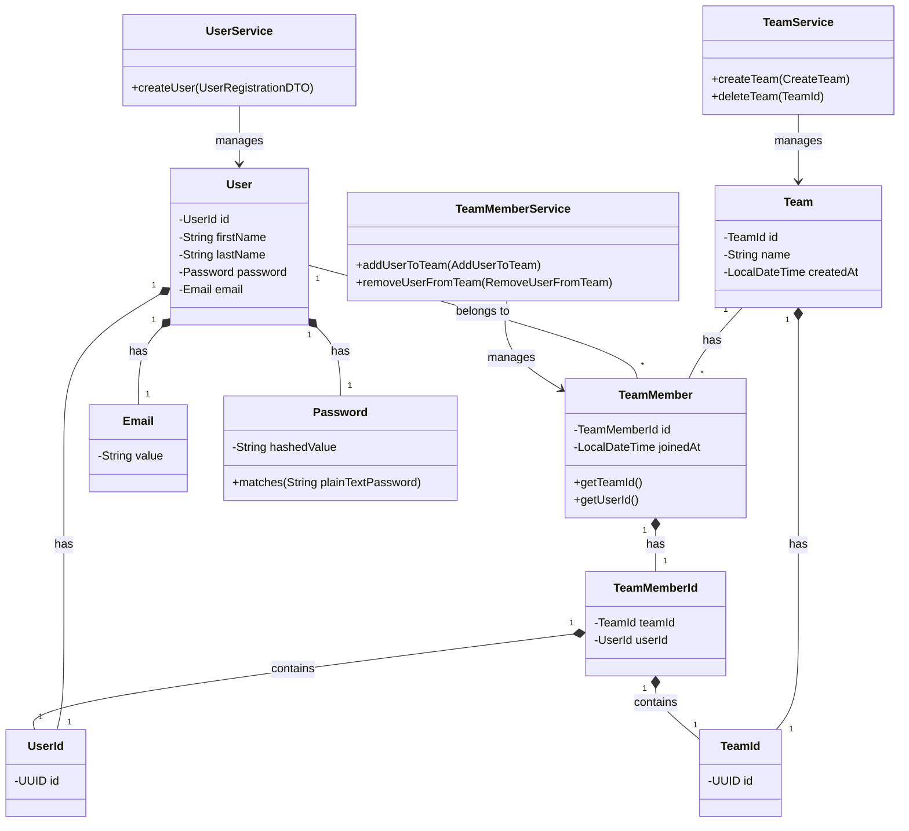

# DDD Example Application

A Spring Boot application demonstrating Domain-Driven Design (DDD) principles with a focus on clean architecture,
modularity, and separation of concerns.

> **Note**: This project is a learning resource for understanding DDD principles in practice. It's intended as an
> educational example, and any feedback or suggestions for improvement are welcomed and appreciated.

## Overview

This project showcases a practical implementation of DDD concepts in a Java Spring Boot environment, featuring:

- Clear domain boundaries and aggregates
- Modular application structure
- Rich domain models with business logic

- Domain events for cross-aggregate communication

## What the Application Does

This application is a team management system built using Domain-Driven Design (DDD) principles. It allows users to:

Register and manage user accounts with personal information (first name, last name, email)
Create teams with names
Add users to teams and remove them from teams
View team details and team members

The core functionality revolves around managing the relationship between users and teams, implemented via a many-to-many
relationship through the TeamMember entity.

## Applied Constraints and Design Decisions

### Domain Constraints

- Email Uniqueness: Each email can only be used by one user (enforced via EmailAlreadyInUseException)
- Password Complexity: Passwords must meet specific strength requirements (length, uppercase, lowercase, digits, special
  characters)
- Team Membership: A user cannot be added to the same team twice (enforced in the TeamMember constructor)
- User and Team IDs: All entities use UUID-based identifiers rather than sequential numeric IDs

## Architecture

The application is organized around two main bounded contexts:

- **User Management**: Handles user registration and profile information
- **Team Management**: Manages teams and team memberships

Each bounded context maintains its own domain models, repositories, and services while exposing carefully designed APIs
for cross-domain interactions.

## Technology Stack

- Java 21
- Spring Boot 3.x
- Spring Data JPA
- Blaze-Persistence for efficient querying and entity views
- Spring Modulith for enforcing modular architecture
- H2 in-memory database for simplicity
- Lombok for reducing boilerplate code

## Key DDD Concepts Demonstrated

### Aggregates & Entities

- `User` - Aggregate root for user data
- `Team` - Aggregate root for team management
- `TeamMember` - Entity representing team membership

### Value Objects

- `Email` - Encapsulates email validation
- `Password` - Handles password hashing and validation
- `UserId` and `TeamId` - Strongly typed identifiers

### Domain Services

- `TeamService` - Core business logic for team operations
- `UserService` - Manages user operations

### Application Services

- `TeamMemberService` - Coordinates operations across aggregates

### Repositories

Each aggregate has its dedicated repository with domain-specific method signatures.

### Domain Events

- `TeamCreated` - Event triggered when a new team is created

## API Endpoints

### User Management

- `GET /api/users` - List all users
- `GET /api/users/{id}` - Get user details
- `POST /api/users` - Register a new user

### Team Management

- `GET /api/teams` - List all teams
- `POST /api/teams` - Create a new team
- `DELETE /api/teams/{id}` - Delete a team

### Team Membership

- `GET /api/teams/{teamId}/members` - List team members
- `POST /api/teams/{teamId}/members` - Add user to team
- `DELETE /api/teams/{teamId}/members/{userId}` - Remove user from team

## Running the Application

### Prerequisites

- Java 21
- Maven

### Setup

1. Clone the repository:
   ```
   git clone https://github.com/yourusername/ddd-example.git
   cd ddd-example
   ```

2. No database configuration needed (using H2 in-memory database)

3. Build and run the application:
   ```
   ./mvnw spring-boot:run
   ```

The application will start on `http://localhost:8080`

## Domain Model

### User Context

```
User
 |-- UserId
 |-- Email
 |-- Password
 |-- FirstName
 |-- LastName
```

### Team Context

```
Team
 |-- TeamId
 |-- Name
 |-- CreatedAt

TeamMember
 |-- TeamMemberId (composite: TeamId + UserId)
 |-- JoinedAt
```

## Advanced Features

### Entity Views with Blaze-Persistence

The application demonstrates the use of Blaze-Persistence entity views to efficiently fetch read-only projections of
domain entities:

- `TeamView` - Read-only projection of Team data
- `UserView` - Read-only projection of User data
- `MemberInfoView` - User projection specific to team membership

## Design Decisions

1. **Explicit Value Objects**: Using record types for immutable value objects
2. **Rich Domain Models**: Business logic and validation in domain classes
3. **Validation**: Domain-specific validation in entity constructors
4. **Bounded Contexts**: Clear separation between User and Team domains
5. **Domain Events**: Using Spring's AbstractAggregateRoot for domain events

## Class Diagram

Here's a simplified class diagram that focuses just on the core domain models and their essential relationships.



## Future Enhancements

- Add authentication and authorization
- Implement more sophisticated domain events
- Add more complex business rules
- Enhance error handling and validation

## Learning & Contributions

This project serves as a practical example for learning DDD principles. If you have suggestions or see opportunities for
better applying DDD concepts, please feel free to:

1. Open an issue with your feedback
2. Submit a pull request with improvements
3. Start a discussion about alternative implementations

The goal is to create a collaborative learning resource for the community, so all constructive input is valuable.